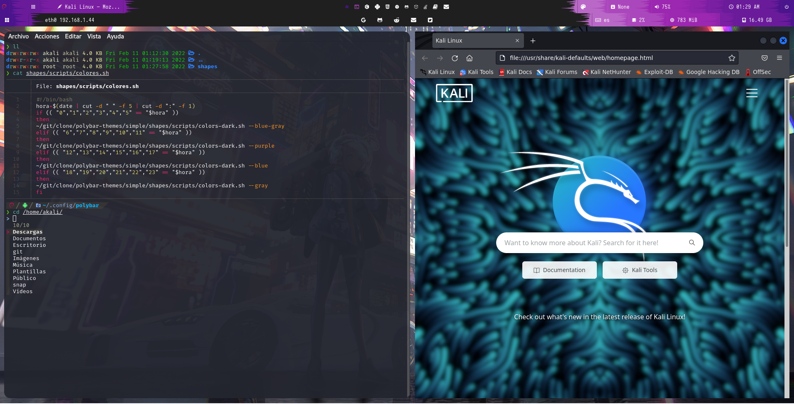

Esto es una instalacion de fzf bat lsd ranger zsh(con plugins) con powerlevel10k automaticamente con una configuracion prehecha.
Los archivos de zsh y los plugins de zsh se envian a una carpeta en el directorio /usr/share/zsh-plugins y la configuracion de powerlevel10k y de zsh se envian a la carpeta /etc/skel . El tema de powerlevel10k se envia a una carpeta que se crea en la ubicacion /usr/share/zsh-p10k/ . Si quisieras cambiar el tema de los zsh tendrias que hacer la instalacion de powerlevel10k manualmente y mover los archivos que crea powerlevel10k en el carpeta personal del usuario y moverlos en la ubicacion /usr/share/zsh-p10k/ .

Tambien se instalara unas tipografias para la terminal. Tendras que cambiar la tipografia de la terminal a hack nerd fonts

<h2>Install</h2>
  
mkdir ~/git
 
  
mkdir ~/git/clone
 
  
git clone https://github.com/zonary123/zsh-with-plugins-and-more
 
  
cd /zsh-with-plugins-and-more
 
  
sudo ./instalation

<h2>Instalacion al terminar</h2>

<h2>Inslatacion de bspwm sxhkd automatico</h2>
<table>
  <tr>
    <td>config de s4vitar</td>
    <td>https://github.com/yorkox0/autoBspwm</td>
  </tr>
  <tr>
    <td>polybar-themes</td>
    <td>https://github.com/adi1090x/polybar-themes</td>
  </tr>
</table>
<h2>Links de cada cosa.</h2>
<table class="default">
  <tr>
    <td>Powerlevel10k</td>
    <td>https://github.com/romkatv/powerlevel10k</td>
  </tr>
  <tr>
    <td>fzf</td>
    <td>https://github.com/junegunn/fzf</td>
  </tr>
  <tr>
    <td>lsd</td>
    <td>https://github.com/Peltoche/lsd</td>
  </tr>
  <tr>
    <td>bat</td>
    <td>https://github.com/sharkdp/bat</td>
  </tr>
</table>
<h2>Tipografia</h2>

La tipografia se instala sola pero tienes que cambiarla manualmente en la terminal.Esto es para poder ver los iconos y las demas cosas y que no veas una terminal con simbolos raros.

<table class="default">
  <tr>
    <td>Hack nerd Fonts</td>
    <td>https://www.nerdfonts.com/#home</td>
  </tr>
</table>
<h2>Plugins zsh</h2>
    <ol style="list-style-type: disc;">
        <li><a rel="stylesheet" href="https://github.com/zsh-users/zsh-autosuggestions">zsh-autosuggestions</a></li>
        <li><a rel="stylesheet" href="https://github.com/ohmyzsh/ohmyzsh/tree/master/plugins/copydir">zsh-copydir</a></li>
        <li><a rel="stylesheet" href="https://github.com/ohmyzsh/ohmyzsh/tree/master/plugins/dirhistory">zsh-dirhistory</a></li>
        <li><a rel="stylesheet" href="https://github.com/ohmyzsh/ohmyzsh/tree/master/plugins/history">zsh-history</a></li>
        <li><a rel="stylesheet" href="https://github.com/changyuheng/zsh-interactive-cd">zsh-interactive-cd</a></li>
        <li><a rel="stylesheet" href="https://github.com/ohmyzsh/ohmyzsh/tree/master/plugins/sudo">zsh-sudo</a></li>
        <li><a rel="stylesheet" href="https://github.com/zsh-users/zsh-syntax-highlighting">zsh-syntax-highlighting</a></li>
        <li><a rel="stylesheet" href="https://github.com/valentinocossar/vscode">zsh-vscode</a></li>
    </ol> 